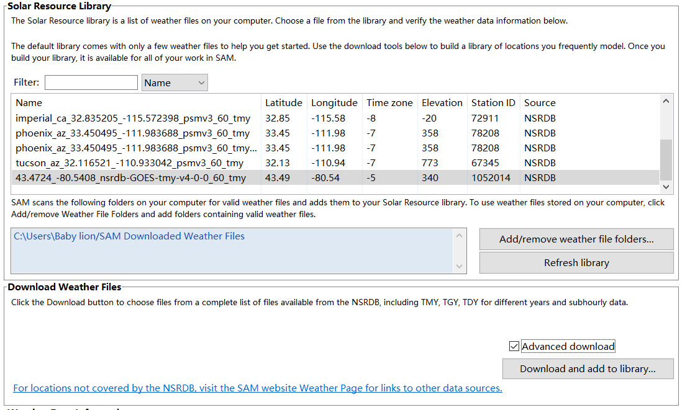
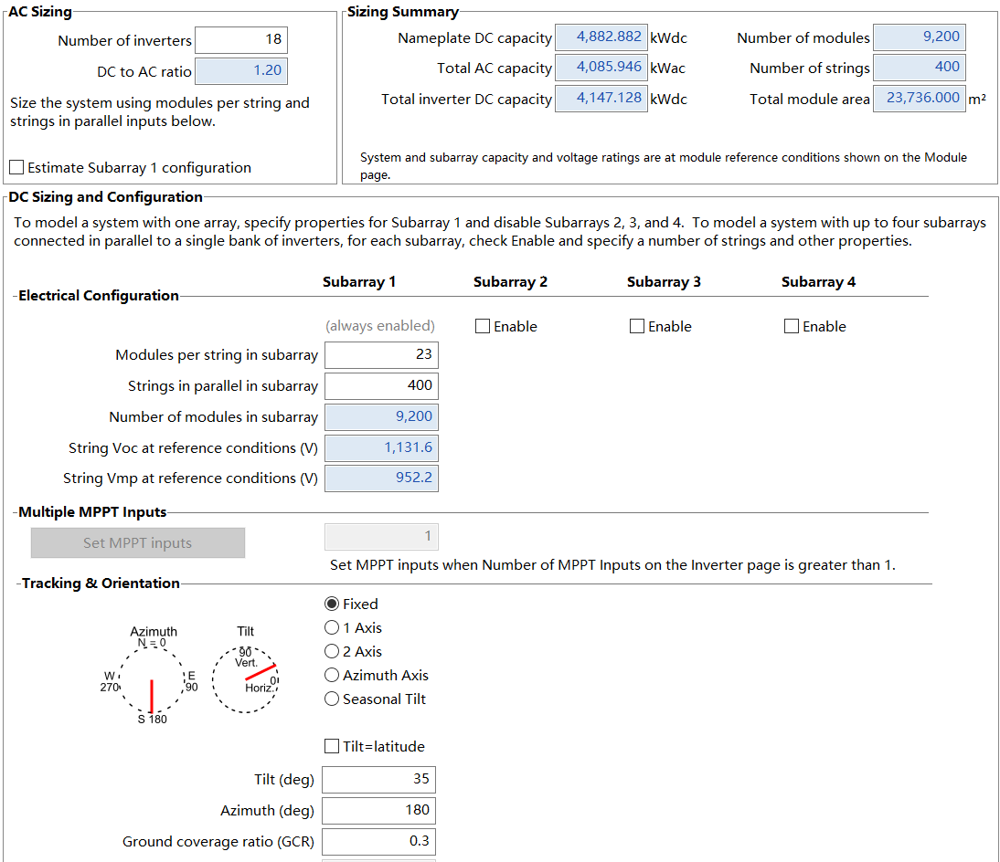

# Solar PV Simulation with NREL SAM

This guide provides a step-by-step workflow for simulating a solar photovoltaic (PV) system at the University of Waterloo campus using NREL's System Advisor Model (SAM). SAM is a free tool for modeling renewable energy performance, finances, and environmental impacts. This example can be extended to hybrid systems (e.g., PV + battery) or other renewable options.

---

## Step 1: Install and Launch SAM

1. Download and install SAM from [**NREL SAM Downloads**](https://sam.nrel.gov/download.html).
2. Launch SAM and click **Create New Project**.
3. In the left panel, select:
   - **Photovoltaic** → **Detailed PV Model** (for accurate temperature/shading modeling)
   - **Financial Model** → **Commercial Owner**
4. Click **OK** to create the project.

---

## Step 2: Input Location and Weather Data

1. Click **Location and Resource** in the left panel.
2. Under **Downloaded Weather Files**, enable **Advanced download**.
3. Click **Download and add to library** and enter the coordinates of the campus: **43.4724° N, -80.5408° W**.
4. Select **43.4724_-80.5408_nsrdb-GOES-tmy-v4-0-0_60_tmy** or the most recent TMY data available.
5. Ensure the selected weather file appears under **Solar Resource Library**.

---

## Step 3: Module Selection

1. Click **Module**.
2. Under **NOCT Method Parameters**:
   - **Mounting standoff**: `Ground or rack mounted`
   - **Array height**: `Two story building height or higher`

---

## Step 4: System Design

1. Click **System Design**.
2. Under **AC Sizing**, set **Number of inverters** to `18`.
3. **Subarray 1**:
   - **Modules per string in subarray**: `23`
   - **Strings in parallel in subarray**: `400`
4. Under **Tracking & orientation**, set **Tilt (deg)** to `35` (optimized for latitude ~43° N).
5. Verify that no system sizing warnings appear in the blue info box at the bottom.

---

## Step 5: Shading and Layout

1. Click **Shading and Layout**.
2. Under **Self Shading for Fixed Subarrays and One-axis Trackers**, select **Standard**.
3. Under **Array Dimensions for Self Shading, Snow Losses, and Bifacial Modules**, set **Number of modules along bottom of row** to `23`.

---

## Step 6: Losses

1. Click **Losses**.
2. Under **Irradiance losses**, click **edit values** under Subarray 1. Enter monthly adjustment factors to account for snow-related energy reductions:

   | Month | Adjustment Factor (%) |
   |-------|-----------------------|
   | Jan   | 30                    |
   | Feb   | 30                    |
   | Mar   | 15                    |
   | Apr   | 5                     |
   | May   | 5                     |
   | Jun   | 5                     |
   | Jul   | 5                     |
   | Aug   | 5                     |
   | Sep   | 5                     |
   | Oct   | 5                     |
   | Nov   | 10                    |
   | Dec   | 25                    |

---

## Step 7: Operating Costs

1. Click **Operating Costs**.
2. Under **Operation and Maintenance Costs**, set **fixed cost by capacity's escalation rate** to `2.5%` to account for inflation.

---

## Step 8: Financial Parameters

1. Click **Financial Parameters**.
2. Adapt to the university context:
   - Under **Project Term Debt**, set **Debt percent** to `0%`.
   - Under **Analysis Parameters**, set **Real discount rate** to `5%` per year.
   - Under **Project Tax and Insurance Rates**:
     - **Federal income tax rate**: `0%`
     - **State income tax rate**: `0%`
     - **Sales tax**: `13%` (Ontario HST rate)

---

## Step 9: Electricity Rates and Load Profile

1. Click **Electricity Rates**.
2. Under **Fixed Charge**, enter `125.96` for **Fixed monthly charge**.

---

## Step 10: Electric Load

1. Click **Electric Load**.
2. Under **Electric Load Data** → **Hourly or Subhourly Load Profile**, set **Electric load scaling factor** to `179`.  
   *(This scaled profile now represents the entire University of Waterloo campus electricity consumption.)*

---

## Step 11: Financial and Performance Analysis

1. Click **Simulate** at the bottom right of SAM. The software will calculate energy production, cash flow, and environmental impacts.

